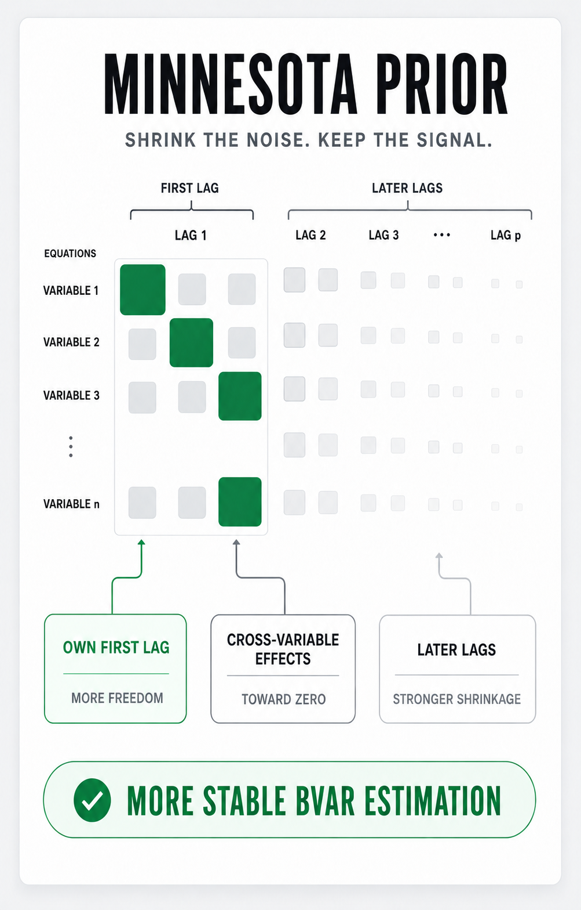
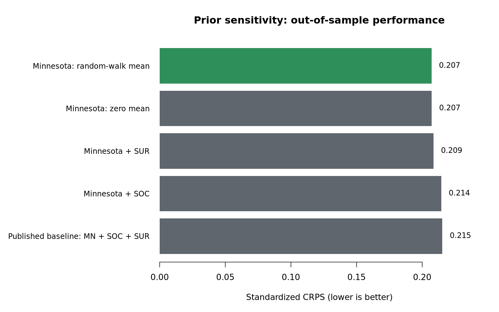
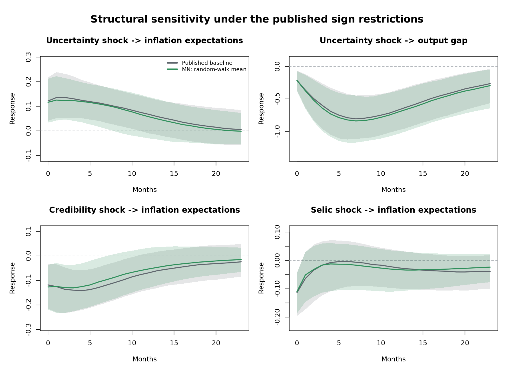

# Prior Sensitivity

This post-publication exercise asks whether the exact five-variable, two-lag BVAR used in the publication workflow remains competitive under alternative prior specifications.

## Analytical question

Bayesian VARs contain many coefficients relative to the available time-series observations. Priors regularize that parameter space, but their assumptions can affect forecasts, posterior uncertainty and impulse responses. A sensitivity exercise should therefore change the prior while holding the data, lag order, likelihood and structural identification fixed.

The published baseline is more specific than “a Minnesota prior”: the current `replicate.R` combines a hierarchical Minnesota prior with sum-of-coefficients (SOC) and single-unit-root (SUR) dummy priors. This extension varies those components one at a time and also tests whether coefficients should be centered on random-walk persistence or zero.

<p align="center">
  
</p>

<p align="center">
  <strong>Figure 1.</strong> Intuition behind Minnesota-prior shrinkage in a BVAR.<br>
  <em>Source: Author's elaboration.</em>
</p>

## Specifications

| ID | Prior mean | SOC | SUR | Interpretation |
| --- | :---: | :---: | :---: | --- |
| `published_baseline` | 1 | Yes | Yes | Prior configuration used in the publication workflow |
| `mn_random_walk` | 1 | No | No | Own first lag is centered on random-walk persistence; other coefficients are shrunk toward zero |
| `mn_zero_mean` | 0 | No | No | All autoregressive coefficients are centered on zero before seeing the data |
| `mn_soc` | 1 | Yes | No | Adds prior information that persistent variables tend to preserve their long-run level |
| `mn_sur` | 1 | No | Yes | Adds prior information associated with unit-root-like behavior at the beginning of the sample |

All configurations retain the hierarchical `lambda` and `alpha` hyperparameters used in the baseline. This is an apples-to-apples sensitivity analysis within `BVAR` 1.0.5, not a comparison across unrelated BVAR engines or identification schemes.

## Validation design

The ranking is based on 36 expanding one-step-ahead forecasts from July 2019 to June 2022. Each origin uses only information that would have been available at that date.

Three unit-free metrics are computed after scaling errors by the pre-holdout standard deviation of each variable:

- RMSE emphasizes larger point-forecast errors.
- MAE gives a more robust point-forecast comparison.
- CRPS evaluates the full posterior predictive distribution; lower values are better.

The overall rank is the mean of the three metric ranks. Full-sample models are then estimated with 60,000 draws and 15,000 burn-in draws. If the Geweke diagnostic flags a hyperparameter, the script automatically doubles both values and recomputes the diagnostics. Posterior effective sample size, Metropolis acceptance and the share of stable posterior draws are also exported.

Finally, the published sign and zero restrictions are applied to the baseline and the strongest alternative. Prior selection is completed before the IRFs are inspected.

## Results

| Specification | Standardized RMSE | Standardized MAE | Standardized CRPS | Rank |
| --- | ---: | ---: | ---: | ---: |
| **Minnesota: random-walk mean** | 0.432 | **0.241** | **0.207** | **1** |
| Minnesota: zero mean | **0.427** | 0.243 | 0.207 | 2 |
| Minnesota + SUR | 0.438 | 0.242 | 0.209 | 3 |
| Minnesota + SOC | 0.451 | 0.249 | 0.214 | 4 |
| Published baseline: MN + SOC + SUR | 0.455 | 0.249 | 0.215 | 5 |

The Minnesota random-walk specification is the best all-around alternative because it ranks first on MAE and CRPS. The zero-mean version is slightly better on RMSE, so the two leading specifications are empirically close. Relative to the published baseline, the winner reduces standardized CRPS by 3.8% and standardized RMSE by 5.1%.

In this sample, adding both dummy priors does not improve forecasts. The result is consistent with the extra SOC and SUR information imposing more persistence than the forecasting holdout rewards. That interpretation is conditional on this system and period; it does not imply that dummy priors are generally undesirable.

The initial 60,000-draw chain for the winning specification was flagged by the Geweke diagnostic for `alpha`. The automatic 120,000-draw re-estimation resolves the warning: the final two-sided p-values are 0.91 for `lambda` and 0.74 for `alpha`. Its posterior stability share is 87.5%, compared with 75.3% in the published baseline. These shares are reported rather than used to discard draws after estimation.

Predictive coverage is below its nominal level for every specification. The holdout includes the COVID-19 shock and the start of a rapid tightening cycle, so this is an important limitation rather than a reason to hide the diagnostic.

<p align="center">
  
</p>

<p align="center">
  <strong>Figure 2.</strong> Standardized CRPS across prior specifications; lower values indicate better probabilistic forecasts.<br>
  <em>Source: Author's elaboration based on the frozen analytical sample.</em>
</p>

## Structural sensitivity

The four central responses retain the same qualitative interpretation under the published baseline and the strongest forecasting alternative. Posterior medians are close and the 68% credible regions overlap substantially: uncertainty raises inflation expectations and contracts the output gap, credibility lowers inflation expectations, and a positive Selic shock lowers inflation expectations on impact.

The main conclusion is therefore not that the alternative prior reverses the published findings. It improves forecasting performance in this holdout while leaving the central structural interpretation broadly robust.

<p align="center">
  
</p>

<p align="center">
  <strong>Figure 3.</strong> Posterior median IRFs and 68% credible regions under the published baseline and the strongest forecasting alternative.<br>
  <em>Source: Author's elaboration based on the frozen analytical sample.</em>
</p>

## Outputs

| File | Content |
| --- | --- |
| `outputs/prior_comparison.csv` | Overall standardized metrics and ranking |
| `outputs/forecast_metrics_by_variable.csv` | RMSE, MAE, CRPS and interval coverage by variable |
| `outputs/forecast_scores.csv` | Forecast-origin-level audit trail |
| `outputs/posterior_diagnostics.csv` | Hyperparameter convergence, acceptance and stability checks |
| `outputs/prior-performance.png` | Out-of-sample comparison used in this README |
| `outputs/irf-sensitivity.png` | Structural comparison between the baseline and strongest alternative |
| `outputs/session-info.txt` | R and package environment |
| `outputs/release-summary.txt` | Short machine-readable run summary |

## How to run

From the repository root:

```bash
Rscript extensions/prior-sensitivity/tests/smoke_test.R
Rscript extensions/prior-sensitivity/run_prior_sensitivity.R
```

The complete release is computationally intensive because the rolling evaluation re-estimates five BVARs at every forecast origin and the structural stage searches for admissible rotations.

For a local execution check:

```bash
PRIOR_SENSITIVITY_MODE=quick \
PRIOR_SENSITIVITY_STRUCTURAL=false \
Rscript extensions/prior-sensitivity/run_prior_sensitivity.R
```

Quick mode is for validation only. Do not use it to overwrite the committed release outputs.

## Scope and limitations

- The winner is conditional on this sample, variable ordering, two-lag model and 2019–2022 forecasting holdout.
- The exercise compares prior specifications available within the same `BVAR` workflow; it does not compare every prior family in the BVAR literature.
- Forecast performance and structural plausibility answer different questions. A better forecasting prior does not automatically invalidate the published structural model.
- Sign restrictions identify a set of admissible structural models rather than one unique model.
- Not every posterior draw is dynamically stable. The exported stability diagnostic makes that limitation auditable; the exercise does not condition the posterior on a stability filter.
