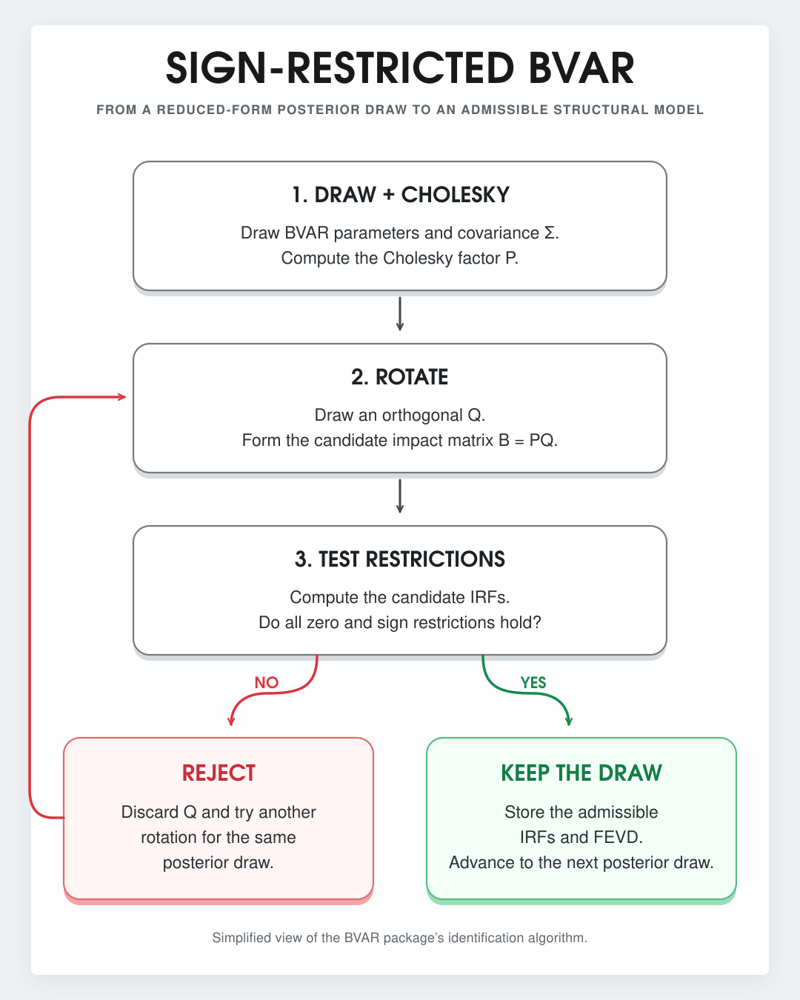

# Central Bank Review Publication Replication

This folder preserves the repository's publication-linked workflow. Run it from the repository root so that the frozen data path and all relative references remain valid. Post-publication exercises are documented separately under [`extensions/`](../extensions/).

This repository documents a research agenda on macroeconomic uncertainty, monetary policy credibility and their effects on inflation expectations and economic activity in Brazil. The project began during my master's degree and continues to develop as part of my doctoral research.

The starting point is the article [*Uncertainty, credibility and monetary policy in Brazil: A BVAR approach with sign restrictions*](https://doi.org/10.1016/j.cbrev.2026.100257), published in *Central Bank Review* in 2026. The repository revisits its empirical framework with a frozen public dataset and the current version of the [`BVAR` package](https://github.com/nk027/bvar), developed by Nikolas Kuschnig and Lukas Vashold. It also records methodological decisions, computational challenges and extensions that were outside the scope of the published study.

The specification recovers the behavior reported in the article under `BVAR` 1.0.4. Exact numerical equality is not guaranteed because the package's sign-restriction algorithm and the computational environment have changed since the original research was conducted. The repository is therefore presented as a transparent reconstruction and continuation of the research process, rather than a claim of exact computational replication.

## The problem

How do uncertainty, monetary policy credibility and changes in the Selic rate affect inflation expectations and economic activity in Brazil?

These variables interact dynamically. Examining them through isolated equations would provide only a partial account of the monetary policy transmission mechanism. A multivariate time-series framework allows their responses to be studied jointly while incorporating prior information and theory-based identifying restrictions.

## Why it matters

Uncertainty can delay consumption, hiring and investment. It may also reduce the effectiveness of monetary policy. Credibility matters because a trusted central bank can anchor inflation expectations with less reliance on changes in the policy rate. Brazil provides a relevant setting because the inflation-targeting period combines domestic instability, external shocks and substantial movements in expectations.

## Data acquisition and validation

The frozen sample contains 234 monthly observations from January 2003 to June 2022. The underlying series and derived indicators come from public sources, including the Central Bank of Brazil, Ipeadata, IBRE/FGV, FecomercioSP and the Brazilian Economic Policy Uncertainty project.

The analytical file is stored as `data/monetary_policy_data.RData`. Loading it creates one data frame named `data`, with the monthly reference dates stored as ISO-formatted values:

```r
load("data/monetary_policy_data.RData")
str(data)
range(data$date)
```

Table 1 presents the variables included in the frozen analytical file, their notation in the published paper and their role in the current script.

<p align="center">
  <strong>Table 1.</strong> Variables included in the frozen analytical dataset
</p>

| Variable | Paper notation | Description | Use in the current script |
| --- | --- | --- | --- |
| `date` | Not applicable | Monthly reference date | Sample index |
| `exp` | EXP | IPCA expectation accumulated 12 months ahead | Baseline |
| `ghp` | GHP | Output gap estimated with the Hodrick-Prescott filter | Retained for extensions |
| `gha` | GHA | Output gap estimated with Hamilton's approach | Baseline |
| `ggr` | GGR | Additional output-gap measure retained for robustness exercises | Retained for extensions |
| `selic` | SELIC | Effective Selic rate | Baseline |
| `igi` | IGI | General Macroeconomic Uncertainty Indicator | Baseline |
| `ci` | CI | Monetary policy credibility index | Baseline |

<p align="center">
  <em>Source: Author's elaboration based on the frozen analytical file.</em>
</p>

The frozen file already covers January 2003 to June 2022 and contains only the analytical variables used in the research.

## Methodological choices

The baseline is a Bayesian Vector Autoregression with five endogenous variables ordered as IGI, CI, GHA, EXP and SELIC. The confirmed specification uses two lags, 60,000 posterior draws and a burn-in of 15,000 draws. With five variables and two lags, the system contains 55 intercept and autoregressive coefficients across the five reduced-form equations.

The prior follows the hierarchical Minnesota specification implemented in [`BVAR`](https://cran.r-project.org/package=BVAR), together with sum-of-coefficients and single-unit-root dummy priors. The package was developed by Nikolas Kuschnig and Lukas Vashold; its [source repository](https://github.com/nk027/bvar) and [companion article](https://doi.org/10.18637/jss.v100.i14) document the estimation framework. This structure provides shrinkage while allowing the degree of persistence to be informed by the data.

Table 2 presents the contemporaneous sign and zero restrictions used to identify the structural shocks. These restrictions reproduce the identification scheme reported in Table 2 of the published article. Rows represent responding variables and columns represent structural shocks.

<p align="center">
  <strong>Table 2.</strong> Contemporaneous sign and zero restrictions
</p>

<table align="center">
  <thead>
    <tr>
      <th>Response / shock</th>
      <th align="center">IGI</th>
      <th align="center">CI</th>
      <th align="center">GHA</th>
      <th align="center">EXP</th>
      <th align="center">SELIC</th>
    </tr>
  </thead>
  <tbody>
    <tr>
      <td>IGI</td>
      <td align="center">+</td>
      <td align="center">NA</td>
      <td align="center">NA</td>
      <td align="center">NA</td>
      <td align="center">NA</td>
    </tr>
    <tr>
      <td>CI</td>
      <td align="center">NA</td>
      <td align="center">+</td>
      <td align="center">NA</td>
      <td align="center">NA</td>
      <td align="center">NA</td>
    </tr>
    <tr>
      <td>GHA</td>
      <td align="center">−</td>
      <td align="center">+</td>
      <td align="center">NA</td>
      <td align="center">NA</td>
      <td align="center">−</td>
    </tr>
    <tr>
      <td>EXP</td>
      <td align="center">+</td>
      <td align="center">−</td>
      <td align="center">NA</td>
      <td align="center">NA</td>
      <td align="center">−</td>
    </tr>
    <tr>
      <td>SELIC</td>
      <td align="center">0</td>
      <td align="center">0</td>
      <td align="center">NA</td>
      <td align="center">NA</td>
      <td align="center">+</td>
    </tr>
  </tbody>
</table>

<p align="center">
  <em>Source: Almeida, Corrêa and Lopes (2026), Table 2.</em><br>
  <em>Note: +, − and 0 denote positive, negative and zero restrictions, respectively; NA denotes an unrestricted response.</em>
</p>

The identification sequence used in this reconstruction follows [Arias, Rubio-Ramírez and Waggoner (2018)](https://doi.org/10.3982/ECTA14468), as implemented in the [`BVAR` package](https://github.com/nk027/bvar) by Kuschnig and Vashold. The empirical application follows [Almeida, Corrêa and Lopes (2026)](https://doi.org/10.1016/j.cbrev.2026.100257).

The identification routine first obtains a posterior draw of the reduced-form parameters and its covariance matrix. It then computes the lower-triangular Cholesky factor. Conditional on that draw, the routine proposes an orthogonal rotation and constructs a candidate structural impact matrix. If the candidate satisfies all contemporaneous zero and sign restrictions, the structural draw is retained and used to compute the IRFs and FEVD. Otherwise, the candidate rotation is discarded and another rotation is attempted for the same posterior draw. The rotation search limit is set to 60,000 attempts. This procedure is visually summarized in Figure 1.

<p align="center">
  
</p>

<p align="center">
  <strong>Figure 1.</strong> Simplified representation of the identification algorithm implemented in the <code>BVAR</code> package.<br>
  <em>Source: Author's elaboration.</em>
</p>

This structural search is distinct from the Metropolis-Hastings step used for the prior hyperparameters. The script reports the Geweke diagnostic and its two-sided p-values for `lambda` and `alpha`. The impulse responses are summarized with 90% and 68% posterior credible regions.

## Findings

The published results and the current two-lag estimation support four main interpretations:

- An uncertainty shock raises inflation expectations in the first months and contracts economic activity for a longer period.
- A credibility shock lowers inflation expectations, while its positive response in activity is not statistically clear.
- A positive Selic shock reduces inflation expectations and contracts the output gap.
- The responses between uncertainty and credibility remain centered around zero, providing no evidence of a meaningful dynamic effect between the two indicators in the sample.

## Limitations

- The results remain conditional on the sample, prior, lag order and identifying restrictions.
- Sign restrictions identify a set of admissible structural models rather than one unique model.
- Random orthogonal rotations and changes in the implementation of the identification algorithm can generate numerical differences across computational environments.
- The current system does not include an external block or fiscal variables. Adding variables increases the reduced-form parameter space and the dimension of the structural identification problem. With the computational resources available during the original research, a larger system was not practical.

My doctoral research continues this agenda in MATLAB, incorporating external and fiscal information that could not be treated jointly in the published specification. The first post-publication extension evaluates sensitivity to alternative prior configurations; an assessment of the `bsvarSIGNs` package remains planned.

## How to run

Requirements:

- R 4.3 or newer
- `BVAR` 1.0.5
- `coda`
- `vars`

Install the required packages:

```r
install.packages(c("BVAR", "coda", "vars"))
```

Open `publication-replication/replicate.R` in RStudio and run the sections in order from the repository root. Alternatively, use `Rscript publication-replication/replicate.R`. The estimation may take time. After the `irfs` object is created, each impulse-response command can be executed separately so that results can be inspected one at a time.

The script is organized into:

1. Package checks
2. Data loading and validation
3. Prior construction
4. Lag-order information
5. Baseline BVAR estimation
6. Convergence diagnostics
7. Structural identification
8. Individual impulse-response plots

## Publication-replication files

```text
publication-replication/
├── README.md                        Publication-linked documentation
└── replicate.R                      Baseline estimation and individual IRF commands
```

Shared data, the identification figure, citation metadata and dependencies remain at the repository root.

## Credits and funding

The published paper was coauthored by Karina Oliveira Belarmino de Almeida, Wilson Luiz Rotatori Corrêa (advisor) and Luckas Sabioni Lopes (coadvisor).

The research received support from FAPEMIG through a Researcher in Science, Technology and Innovation Development scholarship, BDCTI-IV.

## License

The code is available under the MIT License. The frozen analytical file contains public and derived research variables. Original providers are credited in `data/DATA_SOURCES.md` and in the published article.
